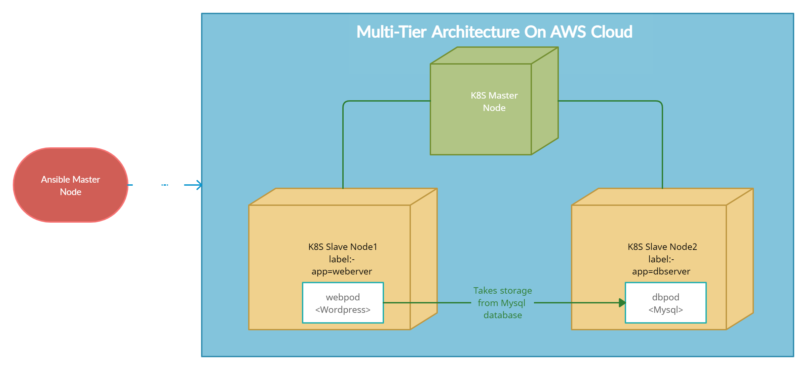

# ARTH - Task 23 👨🏻‍💻 

# Task Description 📄

📌 Automate Kubernetes Cluster Using Ansible

🔅 Launch ec2-instances on AWS Cloud eg. for master and slave.

🔅 Create roles that will configure the master node and slave node separately.

🔅 Launch a WordPress and MySQL database connected to it in the respective slaves. 

🔅 Expose the WordPress pod and the client able to hit the WordPress IP with its respective port.

📌 To setup the ansible master, follow these steps-

- Install ansible
- Create inventory /root/ip.txt
- Go to ansible's config file and set inventory=/root/ip.txt and put host_key_checking=False
- Make sure to chmod 400 arthk8s.pem , the private key.

1) Use your key and inventory here, in place of arthk8s.pem and /root/ip.txt.
2) Also do change the variables in vars folder in each role, if needed.

 Link to the post:- https://www.linkedin.com/posts/activity-6802846192448368640-t4yC
